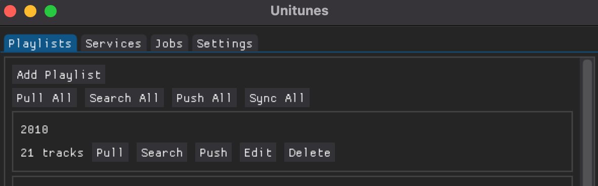
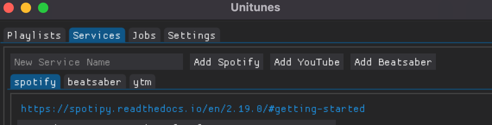

# unitunes [](https://badge.fury.io/py/unitunes) 


A python GUI and library to sync playlists across music streaming services.



## Introduction

unitunes manages playlists across streaming services. unitunes can transfer songs between services and keep playlists in sync.

unitunes stores your playlists in plain text, allowing you to version control your music. Playlists can be pushed and pulled from streaming services. Tracks from one service can be searched on another.

### Current Supported Streaming Services

| Name          | Pullable | Pushable | Searchable |
| ------------- | :------: | :------: | :--------: |
| MusicBrainz   |          |          |     ✅     |
| Spotify       |    ✅    |    ✅    |     ✅     |
| Youtube Music |    ✅    |    ✅    |     ✅     |
| Beatsaber     |    ✅    |    ✅    |     ✅     |

Want to add support for another service? See [contributing](#contributing).

## Usage

```bash
pip install unitunes
unitunes
```

In settings, set the directory to store your playlists. You can version control this directory with git.

Connect services in the service tab. Enter a service name, and click the button to add the corresponding service. Each service type requires some configuration, Spotify requires a client id and secret, and Youtube Music requires request headers.


Playlists can then be added to the playlist tab.

After adding playlists, you can sync them. You likely just want to press the `Sync All` button, which will pull, search, and push all playlists.

## Contributing

unitunes is rapidly evolving. Take a look at the [contributing guide](CONTRIBUTING.md).
